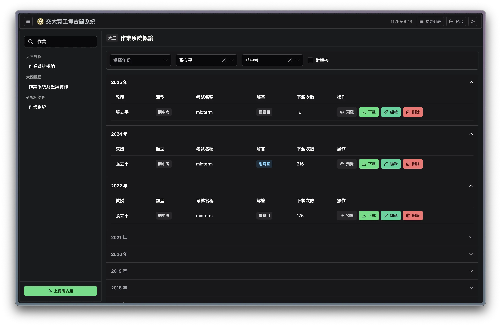
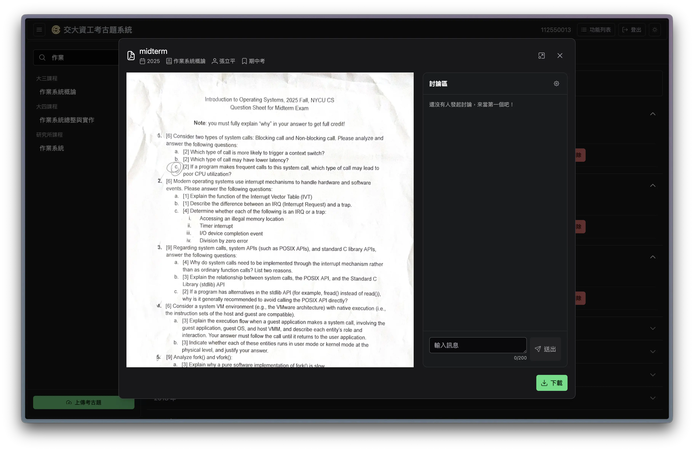
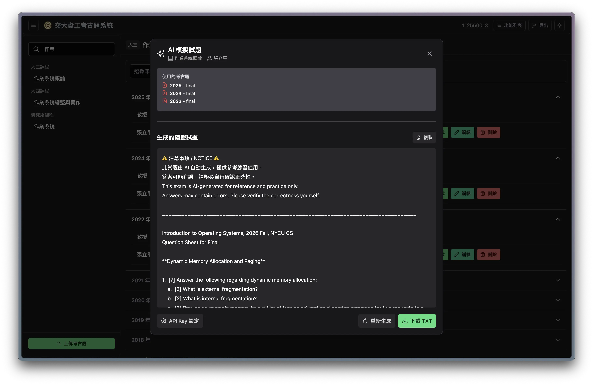

<div align="center">
  <picture>
    <source media="(prefers-color-scheme: dark)" srcset="https://github.com/user-attachments/assets/2950f4b0-f11d-46e4-98fb-28c0e701dcbc">
    <source media="(prefers-color-scheme: light)" srcset="https://github.com/user-attachments/assets/6125c7f1-5e26-4cfc-93dc-67a77720011d">
    
  </picture>
  <h3>交大資工考古題系統</h3>
  <a href="https://github.com/NCTUCSUnion/pastexam/actions/workflows/main.yml"></a>
  <a href="https://github.com/NCTUCSUnion/pastexam/releases/latest"></a>
  
  
</div>

---

## 專案簡介
<p>
  交大資工考古題系統由交大資工系學會開發與維護，旨在彙整並整理課程相關的歷年考試資料（題目、解答與參考內容），協助同學更有效率地進行考試準備。
  因應使用人數成長與功能擴充需求，本系統重新設計並優化整體架構與使用體驗，使資料搜尋、線上預覽與討論交流更加直覺、流暢。
</p>

<p align="center">
  <picture>
    <source media="(prefers-color-scheme: dark)" srcset="https://raw.githubusercontent.com/NCTUCSUnion/pastexam/umami/umami-dark.png">
    
  </picture>
</p>

## 功能特色
* **條件搜尋與篩選**：可依課程名稱、授課教師、年度等條件進行查詢。
* **線上文件預覽**：支援 PDF 與圖片格式，無需下載即可瀏覽。
* **討論區功能**：針對特定課程或考古題進行集中討論與經驗交流。
* **AI 模擬試題**：可選取考古題內容生成模擬試題（後端整合 `google-genai`）。

## 介面預覽
### 搜尋介面
<p align="center">
  
</p>

### 文件預覽與討論區
<p align="center">
  
</p>

### AI 模擬試題
<p align="center">
  
</p>

## 使用技術

| 分類 | 技術 |
| :--- | :--- |
| **前端** | Vue 3、Vite、TypeScript、PrimeVue、Tailwind CSS |
| **後端** | Python、FastAPI、SQLModel、Alembic、ARQ |
| **資料庫 / 快取** | PostgreSQL、Redis |
| **物件儲存** | MinIO（S3 相容） |
| **反向代理** | Nginx |
| **DevOps / CI** | Docker Compose、GitHub Actions |

## 本地開發

### 1. 複製專案
```bash
git clone git@github.com:NCTUCSUnion/pastexam.git
cd pastexam
```

### 2. 設定環境變數
```bash
# Docker Compose（Postgres / MinIO）使用的環境變數
cp docker/.env.example .env

# 後端與前端各自的環境變數
cp backend/.env.example backend/.env
cp frontend/.env.example frontend/.env
```

### 3. 啟動開發環境
```bash
docker compose -f docker/docker-compose.dev.yml build
docker compose -f docker/docker-compose.dev.yml up -d
```

> 開發網站連結：`http://localhost:8080`

## 參與貢獻
我們歡迎任何形式的貢獻與回饋，包含錯誤回報與功能建議：
1. 請先查閱 [Issues](https://github.com/NCTUCSUnion/pastexam/issues)，確認是否已有相關討論。
2. Fork 此專案並建立功能分支。
3. 提交 Pull Request 供維護者審查。

## 授權
本專案採用 [MIT License](LICENSE) 授權。

---

<p align="center">
  Made with ❤️ by <a href="https://github.com/NCTUCSUnion">NCTUCSUnion</a>
</p>
